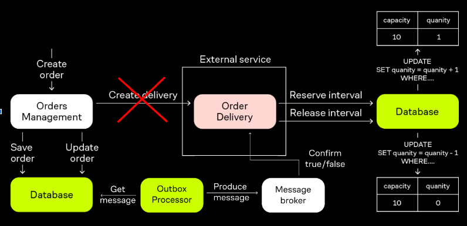

## Microservices-2

### Если вдруг проспал, на семинаре было
1. Outbox pattern
2. Outbox vs Saga

### Материалы
1. [Пример](https://www.gokhan-gokalp.com/en/providing-atomicity-for-eventual-consistency-with-outbox-pattern-in-net-microservices/) реализации "Saga pattern". Про атомарность
2. Использование Saga для микросервисов используя паттерн Outbox. [Статья](https://www.infoq.com/articles/saga-orchestration-outbox/)
3. Как не растерять сообщения. [Тыц](https://habr.com/ru/companies/lamoda/articles/678932/)
4. [Nick Chapsas. Outbox pattern](https://www.youtube.com/watch?v=032SfEBFIJs)
### Задание
Реализуйте outbox паттерн. Необходимо запись в бд(кэширование тоже пойдет) для одного любого доменного сервиса.
Важно:
- использовать промежуточный background-сервис для outbox pattern.   
- чтобы было полное логирование действий.
- чтобы сервис в 75% случаях отправлял отказ, но действие все равно выполнилось

