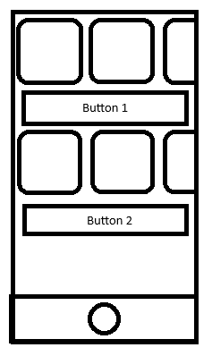

## Mobile-4

## Android
### Если вдруг проспал, на семинаре было
1. Jetpack compose: что это? Для чего?
2. Использование Jetpack compose на примере.

### Материалы
1. [Jetpack Compose](https://developer.android.com/jetpack/compose)

### Задание:
1. Все компоненты должны быть разбиты на разные классы и лежать в отдельной папке Components.
2. Использовать нужно material3 компоненты.
3. [Макет](https://www.figma.com/file/FvfowAcanl9KViBhfCCQN1/Untitled?node-id=0-1&t=hJzAW4QLv9BD00F1-0)
4. [Данные](https://jsonplaceholder.typicode.com/todos)
5. При нажатии на "More" появляется подгрузка и через пару секунд ЛИБО страница с ошибкой, ЛИБО новый объект. При нажатии на "Repeat" фетч идет заново.

## Flutter
### Если вдруг проспал, на семинаре было
1. Пакет Freezed
2. Использование Freezed вместе с Bloc

### Материалы
1. Зачем? Как? Почему? [Туть](https://pub.dev/packages/freezed#motivation)
2. Тоже самое, но в видео и коротко. [Тыц](https://www.youtube.com/watch?v=RaThk0fiphA)

### Задание
Нужно взять ваше предыдущее задание на блоках и переделать его под freezed:
- Теперь все State и Event классы должны быть сгенерированы через freezed
- Все dto объекты должны быть сгенерированы с freezed
- Использовать для dto одно из fromJson/toJson - нужно
- Для блока должно быть создано только 3 состояния:
  - Normal, Loading, Error
  - Но Normal стейт должен хранить в себе мап-модель для UI: 
    - data1: listOf()
    - isLoading1: boolean 
    - data2: listOf()
    - isLoading2: boolean  
- На ui теперь определять состояние надо не через ключевое слово, а через [pattern matching](https://pub.dev/packages/freezed#using-pattern-matching-to-read-non-shared-properties)

_Так надо потому что представьте следующий сценарий_:  
- На экране есть много элементов: несколько списков и несколько кнопок
- Каждая кнопка грузит только свой список
- Чтобы не блочить весь UI вы не должны ставить состояние Loading, а менять только соответсвующий isLoading
- Например, на скринах нажали на верхнюю кнопку, а она начала обновлять только верхний список, а не всю страницу.
- "А для чего тогда state Loading?" - возможно, вы спросите. Это состояние нужно чтобы был "initial" loading - когда грузится вся необходимая первая информация, т.е. в данном случае оба списка например.
- "А для чего тогда state Error?" - когда все плохо

 
 